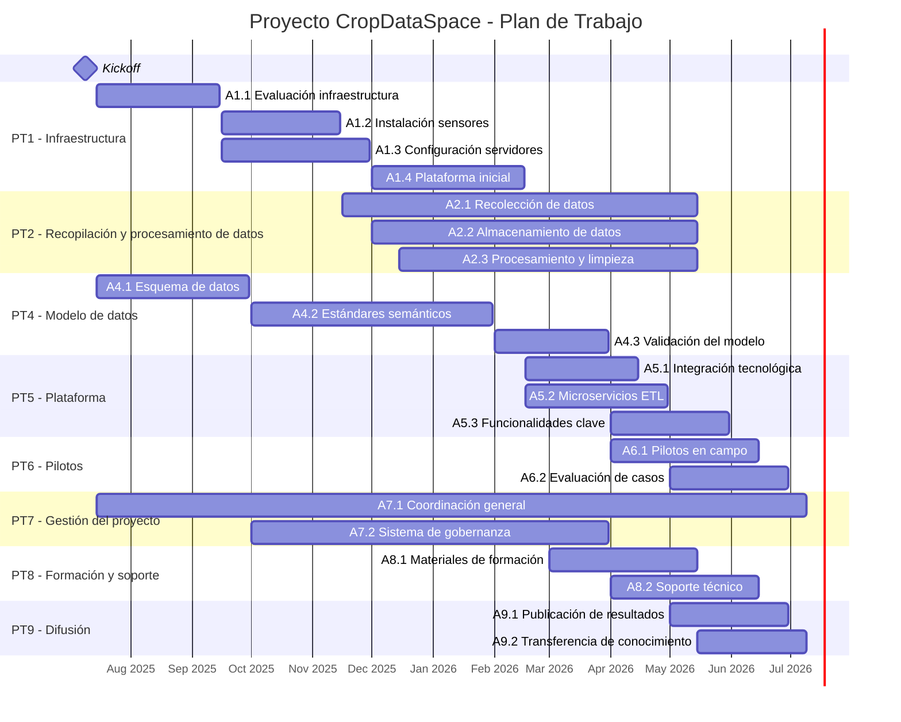

```mermaid
gantt
    title Proyecto CropDataSpace - Plan de Trabajo
        dateFormat  YYYY-MM-DD
        axisFormat  %b %Y

        Kickoff: milestone, kickoff, 2025-07-09, 0d

        section PT1 - Infraestructura
        A1.1 Evaluación infraestructura     :a1_1, 2025-07-15, 2025-09-15
        A1.2 Instalación sensores           :a1_2, 2025-09-16, 2025-11-15
        A1.3 Configuración servidores       :a1_3, 2025-09-16, 2025-11-30
        A1.4 Plataforma inicial             :a1_4, 2025-12-01, 2026-02-16

        section PT2 - Recopilación y procesamiento de datos
        A2.1 Recolección de datos           :a2_1, 2025-11-16, 2026-05-15
        A2.2 Almacenamiento de datos        :a2_2, 2025-12-01, 2026-05-15
        A2.3 Procesamiento y limpieza       :a2_3, 2025-12-15, 2026-05-15

        section PT4 - Modelo de datos
        A4.1 Esquema de datos               :a4_1, 2025-07-15, 2025-09-30
        A4.2 Estándares semánticos          :a4_2, 2025-10-01, 2026-01-31
        A4.3 Validación del modelo          :a4_3, 2026-02-01, 2026-03-31

        section PT5 - Plataforma
        A5.1 Integración tecnológica        :a5_1, 2026-02-17, 2026-04-15
        A5.2 Microservicios ETL             :a5_2, 2026-02-17, 2026-04-30
        A5.3 Funcionalidades clave          :a5_3, 2026-04-01, 2026-05-31

        section PT6 - Pilotos
        A6.1 Pilotos en campo               :a6_1, 2026-04-01, 2026-06-15
        A6.2 Evaluación de casos            :a6_2, 2026-05-01, 2026-06-30

        section PT7 - Gestión del proyecto
        A7.1 Coordinación general           :a7_1, 2025-07-15, 2026-07-09
        A7.2 Sistema de gobernanza          :a7_2, 2025-10-01, 2026-03-31

        section PT8 - Formación y soporte
        A8.1 Materiales de formación        :a8_1, 2026-03-01, 2026-05-15
        A8.2 Soporte técnico                :a8_2, 2026-04-01, 2026-06-15

        section PT9 - Difusión
        A9.1 Publicación de resultados      :a9_1, 2026-05-01, 2026-06-30
        A9.2 Transferencia de conocimiento  :a9_2, 2026-05-15, 2026-07-09
```
